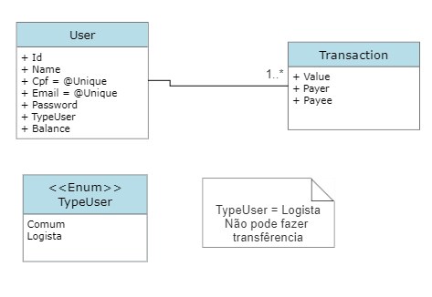

# Projeto PicPay
> Achei esse desafio na internet da PicPay, onde quis testar meus conhecimentos ao implementa-lo.
---
Diagrama básico do projeto:



Todo o projeto possui implementação via Docker, menos os teste que precisam ser rodados localmente.

Tecnologias utilizadas:
    - .Net Entity Framework Core
    - SqlServer
    - Docker
    - xUnit (para os teste unitários)

---
## Para rodar a aplicação basta utilizar o docker-compose.

```bash
docker compose -f "./webapi/docker-compose.yml" up -d --build
```
> Caso o container "webapi" pare de rodar, bastar da um restart.

Com os contêineres rodando, basta acessar a documentação da api nesse  [Endereço](http://localhost:8081/api-docs)

---
### Para acessar a referencia do projeto: https://github.com/PicPay/picpay-desafio-backend